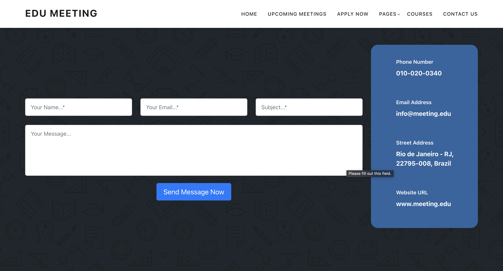

# Edu-Meeting

A project to manage educational meetings effectively with features like scheduling, file sharing, and attendance tracking.

## Features
- User Authentication
- Meeting Scheduling
- Attendance Tracking

## Technologies Used
- **Backend**: Pythoni Django
- **Frontend**: HTML, CSS, JavaScript

## Installation
1. Clone the repository:
   ```bash
   git clone https://github.com/busekeklik/edu-meeting.git
   cd edu-meeting
2. Set up a virtual environment:
    ```bash
     python -m venv myvenv
     source myvenv/bin/activate  # For Linux/macOS
     myvenv\Scripts\activate  # For Windows
3. Install dependencies:
    ```bash
    pip install -r requirements.txt
4. Run the application:
    ```bash
    python manage.py runserver

## Usage
After installation, visit http://127.0.0.1:8000/ to access the platform.

## Screenshots
- **Page:**
  
  <br>

  
  <br>

  
  <br>

  
  <br>
  
  
  <br>

  


  
